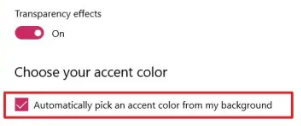
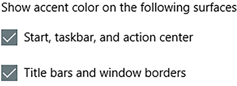

<p align="center">
Background-changer for windows
</p>

<p align="center">
<a href="https://github.com/PascalVallaster/background-changer/blob/main/LICENSE"></a>
<a href="https://github.com/PascalVallaster/background-changer/blob/master/README.md"></a>
<a href="https://github.com/PascalVallaster/background-changer/blob/main/LICENSE"></a>
</p>

## About background-changer

**background-changer** is a python script for changing your desktop's background-image after startup.
To do that it will be added to [windows startup folder](https://www.thewindowsclub.com/startup-folder-in-windows-8), in order to change the image everytime to a new one.

<p style="color:orange" align="center">
Please report errors directly on <a href="https://github.com/PascalVallaster/background-changer/issues">GitHub</a> 
or mail me: <a href="mailto:pascalvallaster@gmail.com?subject=Issue/Bug">pascalvallaster@gmail.com</a>
<p>


---


## Install

### Download:

Download with `git`:

```term
git clone https://github.com/PascalVallaster/background-changer.git
```

or download the `ZIP` file.

### Install dependencies:

- Python 3.6^
  - Standard Library

### Add script to autostart/startup folder

- Execute bat file `install.bat`

- Errors (if occurred) are logged to `install_log.log` (and additionally displayed on screen if executed in terminal window)


---


## Usage

### Windows settings

For the best experience, enable the following setting described in the steps below:

1. Open `Settings` on Windows 10.
2. Click on `Personalization`.
3. Click on `Colors`.
4. Enable `Transparency effects`
5. Under the "Choose your accent color" section, check the Automatically pick accent color from my background option.

<p align="center">

</p>

6. Under the "Show accent color on the following surfaces" section, check both options.

<p align="center">

</p>

Now the color of your Start, Taskbar, Boarders, etc... will change everytime the background changes.

### Adding images

(After successful installation) Wallpapers need to be added to ```wallpapers``` directory.
The images that are saved there will be used as the desktop backgrounds. If the folder contains
just one or no image at all, the script will quit. 


---


## Troubleshooting

### No such file named 'data.json'!
This problem occurs if the script was moved to a different location or the file data.json was deleted or also moved.<br>
To solve this, check:
- if the script is in its original application folder. If not, move it there.
- if the file `data.json` exists. If not, download it from GitHub.<br>
  

### Unable to load current app path
This problem occurs only if the whole application was moved to a different location. In this case you
have to say yes `[y]` to `Do you want to change the app path...`, or move the application to the
original path. Otherwise, the script exits. 
   

### Unable to locate folder 'wallpapers'!
This problem occurs only if the folder `wallpapers` was deleted. Say yes `[y]` to `Do you want to re-create the folder`.
After recreation, see README.md > Usage > Adding images


### An error occurred while changing the background
This problem occurs if the command for changing the background runs into an error. The issue itself will be displayed 
onto the screen. 


---


## Uninstall

Execute bat file `uninstall.bat`

The bat file will now
1. remove the script's shortcut from autostart/startup folder (if there is one)
2. empty the application folder

The application folder remains and needs to be deleted manually (windows sadly doesn't support this specified feature
of "self-destruction" by default, because the explorer is one big process that can't be terminated just like that, 
so the folder is locked and cannot be deleted. [reference](https://superuser.com/questions/1263315/how-to-close-a-particular-opened-folder-using-cmd-or-batch-file))

